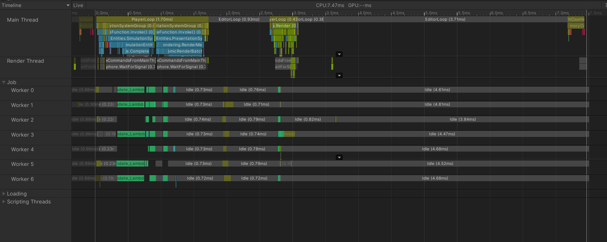
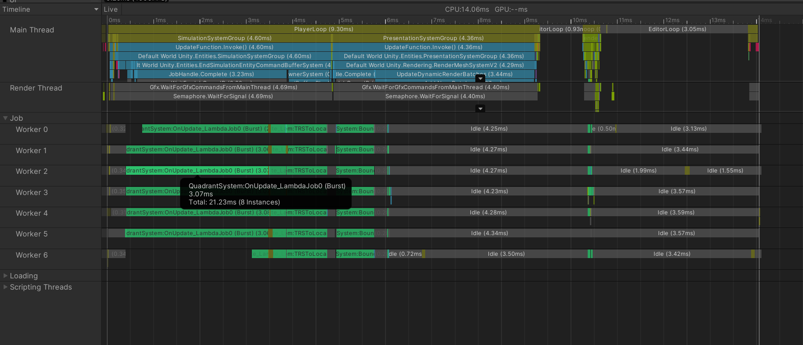
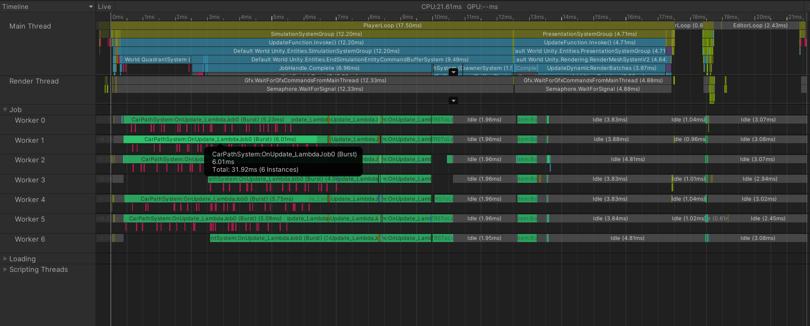
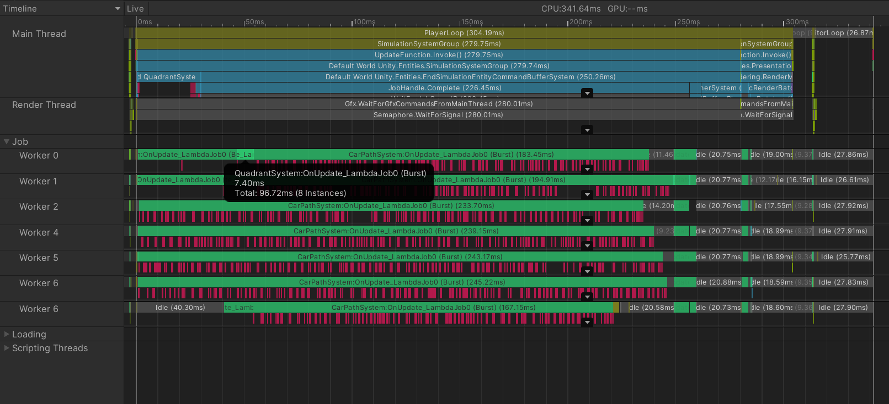
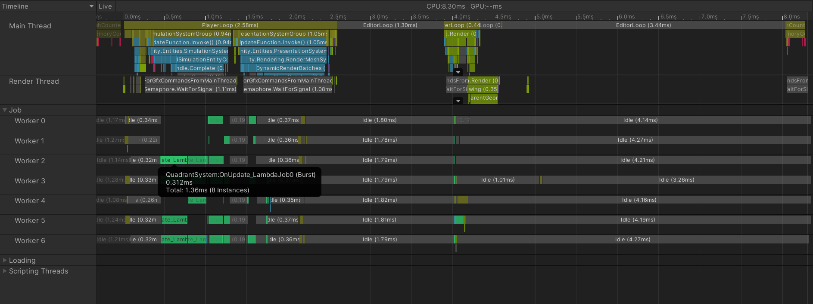
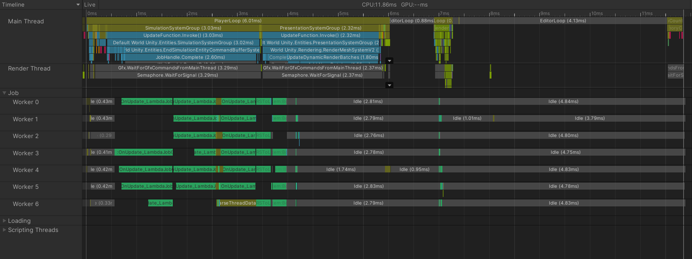
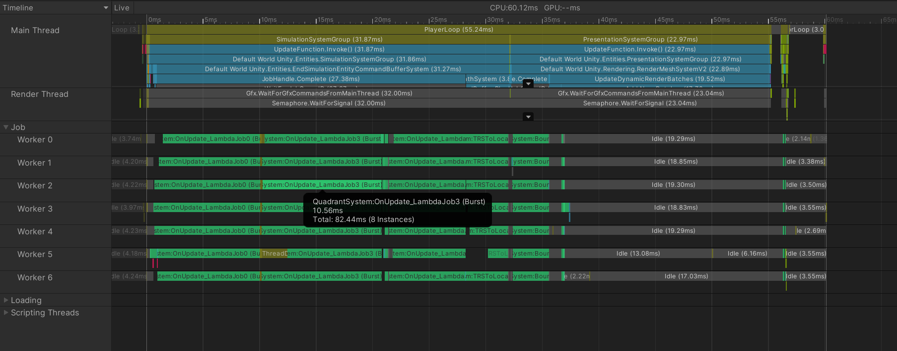
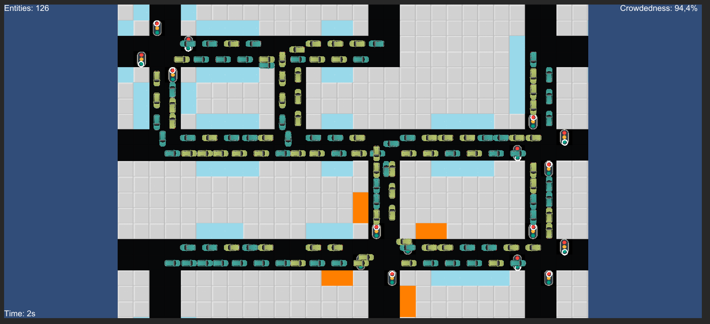
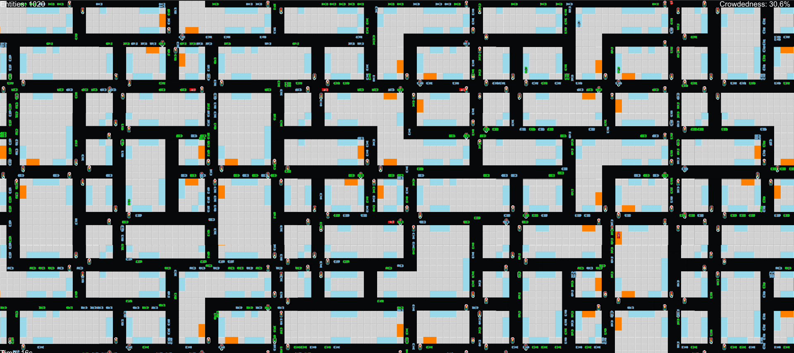
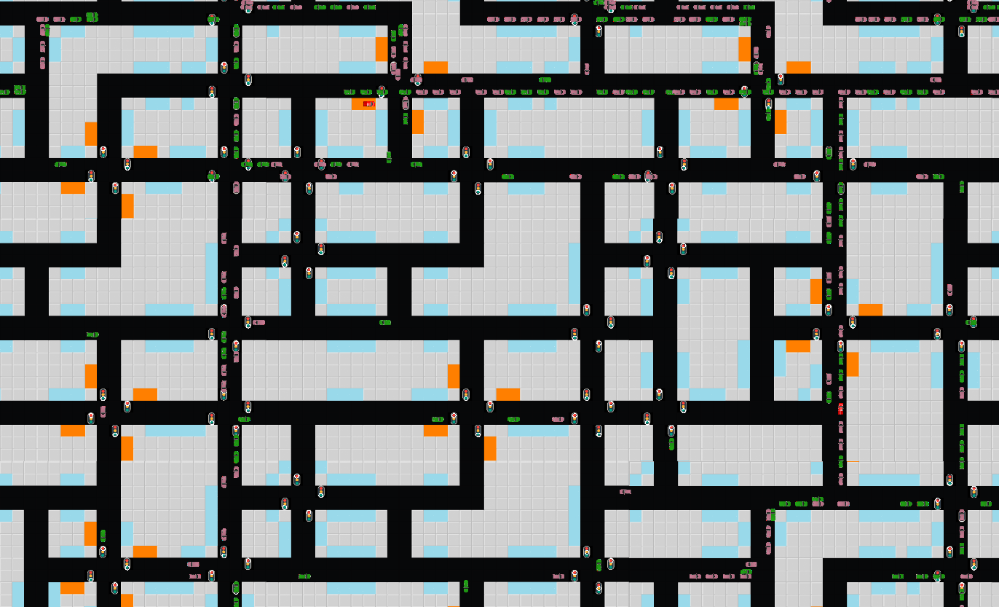

# Traffic Simulation Report

## 1. Project description
 
This section serves as a general description of the project and its features, for more details about the implementation visit section number 2
  

### 1.1 Authors
 Both of the authors are students from Politecnico di Torino and are enrolled in the System and Device Programming course (a.y. 2020/2021)

|Surname | Name | Student number |
|--------|------|----------------|
|Abreu | Samuel Oreste | s281568|
|Blangiardi| Francesco  |s288265|
 

### 1.2 Objectives

 The goal of the project is to explore the potential of the Unity DOTS technology and get familiar with the ECS programming pattern by developing a simulation that takes full advantage of their related optimizations as well as using the Unity Jobs System to create highly optimized multithreaded C# code. More information about the DOTS technology can be found [in this page](https://unity.com/dots).
 For this purpose, the authors have created a simulated environment of a city using Unity, as suggested by the project tutors.
 The simulation is meant to be run from the Unity editor and after having imported the packages listed [in this page](https://docs.unity3d.com/Packages/com.unity.entities@0.17/manual/install_setup.html) under the "Recommended Packages" section.

### 1.3 Features

 The city features streets and intersections, where different type of vehicles (implemented as entities) are allowed to move.
 Vehicles are divided into cars and buses, with each category featuring a different behavioral pattern, while their motion is regulated and limited by:
- Streets
- Intersections
- Traffic lights
- Parking spots/Bus stops
- Other nearby cars

 The entities are meant to move in the city by mimicking as much as possible vehicles moving in real cities, and while the focus of the project was not to give a detailed graphical representation of an urban environment (through animations etc.), the team has developed a simulation able to run a fairly high amount of vehicles with reasonable performances.

## 2. Implementation Details

 Here are listed the most important implementation details of the simulation, as well as an overview of file organization
  
### 2.1 File Organization
 All the code developed by the team is contained in the Assets folder. The most important folders are:
- ECS. This folder contains two subfolders ("DataComponents" and "Systems") that contain all the code related to ECS. Also a "Utils" folder is present where some more C# files are stored that contain functions used by the application's systems
- Scenes. This is where the only scene developed by the team is stored. The scene is composed of three GameObjects that handle the generation and visualization of the map (Map_Setup and Map_Visual) while setting up the most important systems, as well as a Main Camera and a UI object that displays on screen some information about the simulation at run time.
- Visuals. The scripts used by the scene's GameObjects are all inside its "Scripts" subfolder, which additionally contains also the classes used to represent the map internally. This folder also contains the "Textures" folders where all textures and materials used in the simulation are stored.
 All parameters of the application (see section 2.2) can be set from the "config.xml" file in the "Assets/Configuration" folder.

### 2.2 The parameters
  The parameters of the simulation can be set both by the config.xml file (Assets/Configuration) or by the Unity editor (enable "Override Reading Config File" in Map_Setup GameObject). This section presents the table of parameters along with their description.

|Parameter name|Related GameObject|Description|
|--------------|------------------|-----------|
|map_n_district_x|Map_Setup|defines the map width (in terms of districts)|
|map_n_district_y|Map_Setup|defines the map height (in terms of districts)|
|n_entities|Map_Setup|the number of cars that will run in the simulation. Warning: a map of a given size can spawn up to a maximum amount of cars; if n_entities exceeds such number, the maximum number of cars will be spawned instead.
|n_bus_lines|Map_Setup|the number of bus lines that will be spawned in the simulation. Warning: spawning bus lines requires a map with at least 2 districts both in the x and y directions; the map doesn't allow to spawn more than one bus line per district|
|frequency_district_X|Map_Setup|This is a group of parameters (X goes from 0 to 3). They define the frequency the corresponding district type will be chosen during map creation (choosing a higher frequency with respect to other will generate a map comprised of mostly the respective district type). To disable a given district type set its frequency parameter to 0.|
|max_starvation_time|Map_Setup|it represents the maximum time in seconds a vehicle will follow traffic rules while at an intersection. After this time has elapsed, the vehicle will get into the intersection as if it was completely free (it can still be detected by other vehicles). Warning: this can lead to vehicles overlapping, however it should be set to a reasonably low value (suggested: 2-3 times vehicle speed) to prevent excessive starvation for vehicles that are not favored by traffic rules (e.g. vehicles turning left at intersections)|
|maxCarSpeed|Map_Spawner|sets the maximum speed of cars|
|maxBusSpeed|Map_Spawner|sets the maximum speed of buses|
|minimumTrafficLightTime|Map_Spawner|describes the minimum amount of time a traffic light will be green|
|maximumTrafficLightTime|Map_Spawner|describes the maximum amount of time a traffic light will be green|
|differentTypeOfVehicles|Map_Visual|the number of different colors spawned cars may have|

### 2.3 The map
 The map is generated entirely through script and is divided in several "districts" (the number of districts the map is composed of can be set through parameters). Each district is chosen randomly (according to the "frequency" parameters) from a set of 4 different district types:
 all of them are defined by a unique structure and contain several intersections (12, of which one features bus stops) but all have (for simplicity's sake) the same dimension and are compatible with each other (e.g stacking any number of district in any combination of district types and in any direction gives shape to a street network where any road can be accessed from any position). Additionally every district is divided into tiles, where a tile is equivalent to the space occupied by a single car, which can be of several different types (road, building, traffic light, etc.).
 The map is stored internally in two different classes, both of which are contained in the Visuals/Scripts subfolder; they follow a singleton architectural pattern, and thus, are instantiated only once in Map_Setup:
- Map (instantiated as CityMap). It contains information related to each tile as well as some general information on the map (number of districts, dimension of each district etc.). It is used (in a read-only representation) in CarSpawnerSystem(see section 2.5).
- PathFindGraph (instantiated as CityGraph). As the name suggests this class is used for computing the path each vehicle has to take. As such, it is a much more compact data structure compared to CityMap since it only needs to store information on intersections (their coordinates, where they allow to go and with which cost, defined as number of tiles) together with a matrix (usually small) that stores the type of each district present in the map. Intersections can only allow to go to up to 4 directions (up, right, down and left), and is treated by the algorithms as a node of the graph, with each node being identified by an x and y coordinate (the graph is organized as a matrix).

 Note: since the PathFindGraph is structured as a matrix, some parts of road are considered as intersections (and therefore graph nodes) even if they actually don't allow to turn left or right (vehicles may still perform U turns in these kind of intersections)

### 2.4 The Entities

 As any Unity project based on DOTS and ECS, our simulation features several different types of entities, each one being defined by their Components (section 2.5) and being processed by a set of Systems (section 2.6). All the entity types developed contain the Translation component and possibly some other default components (e.g. Rotation, RenderMesh, NonUniformScale etc.)

#### 2.4.1 Districts
  These type of entities are in charge of two tasks: spawning car entities and render the texture of the corresponding district type. The former is carried out by the CarSpawnerSystem and is done only once per district, while the latter is done in Map_Visual (first frame) together with the spawning of the district entity itself. 

#### 2.4.2 ParkSpots

  ParkSpot entities are only identified by the ParkSpotTag (a Tag is a Component without data associated to it), they are not tasked with any rendering (parking spot visuals is dealt with by the district entities, whose textures feature several light blue tiles) and are only used in the QuadrantSystem to notify cars looking for a parking spot of their presence. They are spawned by Map_Setup using a dedicated function in Map_Spawner 

#### 2.4.3 BusStops
  These type of entities are very similar to ParkSpot entities, the only difference being that there is a fixed amount of them (4 per district) and that they are reserved for buses when they reach the corresponding Bus Stop Intersection. Likewise the entities themselves do not render any visual component but their position; it is represented in the district texture by the orange areas. 

#### 2.4.4 TrafficLights
  TrafficLight entities are identified by the TrafficLightComponent and are processed by the TrafficLightSystem and the QuadrantSystem. Each traffic light contains information about its state (Whether or not is it red or vertical) and the amount of time the traffic light is set to green (This number is obtained by randomly selecting a number between minTrafficLightTime and maxTrafficLightTime). Just like ParkSpots and BusStops they are spawned in the first frame by Map_Setup. They are rendered as a small white circle (its positioning with respect to the tile of the map determines the state of the traffic light) 

#### 2.4.5 Cars
  Cars are the most important entity of the simulation and can contain different types of components at different points in time. As mentioned in 2.4.1 they are spawned by the CarSpawnerSystem, which initializes most of their components. Their movement is regulated by the QuadrantSystem, which makes them avoid colliding with other cars along with some other functionalities.
  Their behavioral cycle is the following:

- PathFinding: the cars have a CarPathParams component and are therefore processed by the CarPathSystem. In this phase a random intersection in the whole map is selected and a path is computed within one frame, at the end of which the CarPathParams component is removed and the path is stored into a DynamicBuffer<CarPathBuffer> attached to the entity.
- PathFollowing: all cars that contain the VehicleMovementData (initialized in CarSpawnerSystem) are processed by the VehicleMovementSystem, which in this phase moves the cars according to the information contained in the dynamic buffer.
- Parking: after reaching the last node in the path the cars start moving in random directions (still through the VehicleMovementSystem) looking for a free parking spot (mimicking human behavior) until the QuadrantSystem notifies them that there's one available in their immediate right. After that the car parks into the parking spots and waits a fixed amount of time, after which the VehicleMovementSystem will attach the CarPathParams component to it in order to start a new cycle.

#### 2.4.6 BusLines
  These entities are identified by the BusPathParams component and are processed only once and only in the first frame by the BusPathSystem. Each bus line has a starting district (and therefore a starting Bus Stop Intersection), while the computed path goes through the starting district and two more random districts in the map. After path computation the path is stored into a blobArray (a read-only data structure that can be shared between entities) and the BusLine entities are destroyed. 

#### 2.4.7 Buses
  Buses are very similar to cars (they also have a VehicleMovementData component) but their motion is handled by the BusMovementSystem. They are spawned after the path computation in BusPathSystem, while their behavioral cycle consists only in following the path of their respective bus line (in two possible verses) and in stopping at bus stops for a fixed amount of time. 

### 2.5 Components

  In this subsection some general information about the custom components used in the simulation are listed
  

| name | related entities | related systems | description |
|------|------------------|-----------------|-------------|
| BusPathComponent | Buses | BusMovementSystem | contains a reference to the related bus line's path, as well as some other information |
| BusPathParams | BusLines | BusPathSystem | contains some setup information to compute the path that will be used by bus entities |
| BusStopTag | BusStops | QuadrantSystem | a tag that identifies bus stop entities|
| CarPathParams | Cars | CarPathSystem | setup information to compute the path for cars |
| CarSpawnerComponent | Districts | CarSpawnerSystem | data related to the district and the number of cars to spawn |
| ParkSpotTag | ParkSpots | QuadrantSystem | a tag that identifies bus stop entities |
| TrafficLightComponent | TrafficLights | TrafficLightSystem, QuadrantSystem | stores the state of the traffic light (can be traversed or not)|
| VehicleMovementData | Buses, Cars | BusMovementSystem, CarMovementSystem, QuadrantSystem | contains information on the movement of the bus/car and on its state (moving, turning, parking etc.)|

### 2.6 Systems

  Here are described the most important details of the main custom systems used by the application. All the most critical operations are designed to be executed in parallel on multiple cores through the usage of worker threads.

#### 2.6.1 TrafficLightSystem
  This is a simple system that updates the state of a given traffic light entity (and its translation component) depending on the elapsed amount of time and its previous state. 

#### 2.6.2 CarSpawnerSystem
  This system processes District entities containing the CarSpawnerComponent, and generates a number of car entities contained in the component inside of the related district. It also initializes the CarPathComponent needed by cars to compute the path they're going to follow. This means that all spawned cars will be processed by the CarPathSystem in the next frame: this is an expensive operation and requires allocating an amount of memory that scales with the size of the graph for each car, so each CarSpawnerComponent also contains a "delay" field that allows the System to deal with each districts at different points in time (thus preventing the simulation from crashing when run with a high number of entities in a big map) 

#### 2.6.3 CarPathSystem and BusPathSystem
  Both of these systems have the purpose of computing a path. They work on a representation of CityGraph that can be used in read-only mode by parallel Jobs (a native array of structs). The computation is done using the [A\* algorithm](https://en.wikipedia.org/wiki/A*_search_algorithm) which guarantees optimality with reasonable performances; the downside is that each Job needs to work on its own copy of the graph, which was limited to only the relevant nodes in the graph in order to allocate (and therefore free) as least memory as possible for each computation. The differences between the two systems is that BusPathSystem follows a more complex procedure due to the fact that its path has to be circular: it receives through BusPathParams the coordinates of 3 districts and computes a path for each combination of two of those districts on a graph representing only the districts of the map; then for each edge of this path the system computes the path on the actual graph going from the bus stop Intersection of the starting district to the one of the destination district (with some additional constraints to adjust the overall bus path); finally, after joining all these smaller paths, it stores the complete circular path into a blobArray for the bus entities to read. Additionally BusPathSystem takes care of spawning the bus entities. 

#### 2.6.4 BusMovementSystem and CarMovementSystem
  These systems handle the path following of their respective entities together with their other possible states: CarMovementSystem deals with the parking phase of cars, while BusMovementSystem regulates the stopping procedure buses have to do whenever they reach a bus stop intersection. Both of these system work together with the QuadrantSystem to prevent vehicles from colliding, from taking illegal turns at intersections and to allow them to detect traffic lights and free ParkSpots/BusStops. 

#### 2.6.5 QuadrantSystem
  As stated in section 2.6.4, this System basically works as a "Nearby entity detection" System: it computes whether a given vehicle can move according to its pathing decisions or if it has to stop for any reason (e.g. there are other vehicles in front of it, it can't cross an intersection because of a red semaphore or if it has to give precedence to other cars) and it detects nearby free ParkSpots/BusStops. The system works as follows:
- A few NativeMultiHashMap are allocated as private variables, each one representing one or more type of entities and all of them using as key an integer computed by hashing a Translation value. 
- Each key represents a "Quadrant" (a small area of the map, set to be a 5x5 tile square), the idea being that every tile of the CityMap is identified by only one Quadrant (and therefore a key in the hashMap). 
- The hashMaps representing immovable, unchanging entities (ParkSpots and BusStops) are filled with the respective entities only once by hashing their Translation component, while the rest (TrafficLights and vehicles) are filled once every frame since they may change the quadrant they are in due to movement (vehicles) or they need to refresh their related information inside the hashmap (traffic lights).
- Vehicles can detect if entities of a given type are present in a position they are interested in (e.g. right in front of them or to their side) by cycling through all the entities located within the Quadrant of the aforementioned position. They can do so by hashing the position into an integer and using the HashMap of the given type(s).
- Depending on the state of the vehicle, one or more positions will be probed: when the vehicle is inside a road the system will probe only the position right in front of the vehicle (the position on the right side may also be probed if the vehicle has to park/stop); if instead the vehicle is at an intersection the system will probe several different positions depending on where the vehicle has to turn (generally the vehicles are meant to stop if the Italian Road System requires them to)

Since these operations require populating hashMaps and cycling through entities, and since (differently from pathFinding) this is done once every frame and for every vehicle, the QuadrantSystem is the most critical part of the simulation when it comes to performances. Its implementation has been made considering a tradeoff between performances, traffic jam avoidance and correctness.

### 2.7 Notable behaviors
  in this subsection we highlight and explain some details about the behavior of the entities running in the simulation

#### 2.7.1 Vehicles
 Vehicle motion is a critical part of the simulation and as stated before its rules were defined considering a tradeoff between performances, collision avoidance and traffic jam avoidance.
 While the motion outside of intersections is straightforward (vehicles will stop moving if they detect obstacles in front of them), managing traffic at intersection by strictly following the Italian traffic rules would lead to several problems in crowded cities, like frequent traffic jams or starvation for vehicles that are not favored by traffic rules.
 Therefore the team has implemented some non-standard behaviors at intersections in order to limit such problems:

- Surpassing. When a vehicle is not allowed to turn (either right or left) at an intersection because of traffic rules it will enter in the "surpassable" state: the vehicle will move slightly to the side (towards the center of the street if turning left, towards the wall if turning right) and will allow other cars to move next to it. Then the surpassable vehicle will exit the intersection as soon as it is allowed, while the vehicle that moves next to it may have different behaviors: if it's not going in the same direction as the supassable vehicle and is allowed to cross the intersection it will effectively surpass the vehicle and continue with its motion; if it's not going in the same direction as the surpassable vehicle but it's not allowed to cross the intersection then it will either behave normally (it will stop and block other vehicles behind it) or, if it's turning in the opposite direction as the surpassable car, it will enter the surpassable state for its direction; finally, if the vehicle has to turn in the direction where the surpassable vehicle is trying to turn, it will stop and will enter the surpassable state only after the surpassable vehicle is no longer to its side. Through this procedure a car not being able to turn doesn't necessarily block all the cars behind it, thus limiting the problem of traffic moving too slowly. Also this partially increases the walkable area of the city (in certain situation the tile right before the intersection can host up to three vehicles).

- Starvation limit. Even if an intersection is not overcrowded and allows cars to move inside of it, it may happen that vehicles turning in a certain direction will have to wait for an undefined amount of time before being able to cross the intersection. An example may be the case of a "T" intersection: vehicles that want to enter the main road by turning left have to give precedence to cars coming from the right, which means that they won't be able to cross the intersection as long as there are vehicles entering from the main road. Since this can create traffic jams rather frequently the team has given the possibility to limit the maximum amount of time a vehicle can wait at an intersection (see section 2.2, parameter max_starvation_time), after which the vehicle will enter the intersection as if it was completely free. Note that this is valid only for vehicles at intersections (this behavior will be turned off as soon as the vehicle changes its orientation). It is also suggested to set the related parameter at a reasonable value (this behavior is meant to be an exception and should not be triggered frequently, but setting it to a high value can cause frequent traffic jams), it is suggested to set it as 2-3 times the speed of cars.

#### 2.7.2 TrafficLights
  In order to minimize the problems mentioned in the previous subsection (and as suggested by the project tutor), the team has developed traffic lights so that each intersection has a random period. See section 2.2 (parameters minimum and maximum trafficLight time) for more details

## 3. Results

 In this section several runs of the simulation with varying parameters along with some additional information are reported

### 3.1 Simulations
 DISCLAIMERS: 
- Average fps is the value measured after the spawning phase has ended. Lowest fps is usually reached during the final stages of car spawning. Additionally, as the camera positioning and zoom can have an impact on performances when many entities are being rendered, the fps measurements where taken while maintaining the initial position of the camera.
- Crowdedness corresponds to an estimation of running_entities/max_spawnable_entities in percentage. This value can be seen from the simulation UI (it can be slightly higher than 100% since it's calculated through an estimation, see section 4 for some more details)
- Total number of entities corresponds to the "Matching Entities" of the Entity debugger (it is the number of vehicles + entities that compose the map)
- The following simulations were run by setting all the frequency parameters for districts to 1.
- Vehicle speed for both cars and buses was set to 3. Max_Starvation_Timer was set to 8.
- MinTrafficLightTime and MaxTrafficLightTime were set to 2 and 4 respectively
- The number of bus lines is set to 1% of cars whenever possible (this means that buses compose nearly 2% of the traffic). Note: impact on performance for buses is the same as other vehicles after the spawning phase.
- Simulations are identified by an id describing the most relevant parameters used. The ones ending with the "sat" correspond to a Crowdedness higher than 90% (they may be difficult to replicate exactly since this number can vary slightly because of random generation of the map). They are created by setting a very high amount of cars and bus lines (more than the map should be able to handle).
- The following simulations were run on a System with the following specifics:
 Processor: Intel(R) Core(TM) i7-7700HQ CPU @ 2.80GHz   2.81 GHz
 RAM installed = 16,0 GB
 Graphics Card = NVIDIA GeForce GTX 1060

|Name Id| Graph size (in nodes) |Total vehicles | Total number of entities | Crowdedness | Peak fps | Lowest fps | Average fps |
|-------|-----------------------|---------------|--------------------------|-------------|----------|------------|-------------|
| 1x1_1 | 12 | 1 | 78 | 0.7% | 420 | 360 | 400 |
| 1x1_20| 12 | 20| 99 | 14.6%| 415 | 370 | 400 |
| 1x1_50| 12 | 50| 136| 36.5%| 415 | 390 | 400 |
| 1x1_100| 12| 100| 177| 74.9%| 350| 300 | 330 |
| 1x1_sat| 12| 126| 203| 94.3%| 350| 290 | 330 |
| 2x2_1 | 48 | 1 | 343 | 0.2% | 400| 360 | 380 |
| 2x2_100| 48|102| 435 | 19.1%| 380| 350 | 370 |
| 2x2_400| 48|408| 734 | 76.4% | 370| 340 | 360 |
| 2x2_sat| 48|547| 881 | 102.4%| 370| 350 | 360 |
| 5x5_1 | 300| 1 | 2070| 0.0% | 390 | 340 | 380 |
| 5x5_500| 300|510|2610| 15.3%| 380 | 320 | 360 |
| 5x5_1k|300|1020|3133| 30.6% | 375 | 330 | 360 |
| 5x5_2k|300|2040|4106| 61.1% | 350 | 290 | 330 |
| 5x5_sat|300|3366|5457|100.9%| 340 | 290 | 325 |
| 15x15_1|2700|1 |18915| 0.0% | 390 | 360 | 370 |
| 15x15_5k|2700|5100|23926|17.0%|320| 260 | 290 |
| 15x15_10k|2700|10200|28985|34.0%|250|220| 240 |
| 15x15_20k|2700|20400|39265|67.9%|190|170| 180 |
| 15x15_sat|2700|30337|49223|101.0%|155|140|150 |
| 30x30_1 |10800|1    |75470|0.0% |300 |280|290 |
| 30x30_20k|10800|20800|96220|17.3%|170|100|160 |
| 30x30_35k|10800|36400|111930|30.3%|140|90|120 |
| 30x30_70k|10800|71400|146511|59.4%| 100 |45| 75|
| 30x30_sat|10800|121339|197030|101.0%| 75 |20 | 52 |
| 70x70_1 |58800|1     |411528 | 0.0% | 150| 100| 140|
| 70x70_100k|58800|102000|513699|15.6%| 55 | 20 | 45 |
| 70x70_150k|58800|153000|563940|23.4%| 45 | 15 | 35 |
| 70x70_300k|58800|306000|717230|46.8%| 19 | 3  | 19 |
| 90x90_1 | 97200 | 1 | 679639| 0.0% | 92 | 90 | 91 |
| 90x90_100k| 97200|102000|782616|9.4%|40 | 20 | 38 |
| 90x90_300k| 97200|306000|986669|28.3%|17.5|2.5|17.5|

### 3.2 Comments and observations
 In the following are explained some considerations about the most critical parts of the project after having performed the simulations

#### 3.2.1 The impact of the map
 In the results table the team reported several simulations featuring a single vehicle (the ones with suffix _1). The purpose for these simulations was to measure the weight on performance of the entities composing the map while varying its size. In fact, altough the map itself contains mostly passive entities (ParkSpot, BusStops and District entities), the presence of TrafficLight entities has a non negligible weight on performances when the map reaches 2500+ districts as they are processed both by the TrafficLightSystem (less impactful as it only updates data and translation of trafficLights that are changing state i.e. once per traffic light every several seconds) and, most importantly, the QuadrantSystem which has to populate the internal NativeMultiHashMap with all the trafficLights entities (and their updated state) once per frame. The lambda job that takes care of that also deals with populating the NativeMultiHashMap with vehicle entities, so its impact on performance scales also with the number of vehicles running in the application: the team had considered performing that lambda job once every couple of frames to minimize its impact on performance, but such improvement was discarded in order to provide a correct and updated NativeMultiHashmap to the third QuadrantSystem lambda job (which takes care of collision avoidance) even in the most busy frames of the spawning phase.
 In conclusion, the impact of map entities on performances is negligible with respect to editor loops for small to medium map sizes as shown by the following screenshot of the profiler (taken from 30x30_1):

 However the map only can bring the framerate down to 90 fps in bigger maps like shown in the following image (90x90_1):

#### 3.2.2 The Spawning phase
 Spawning of cars and buses in the whole map is done in a variable amount of time (based on map size in districts); each district is assigned a certain number of entities and CarSpawnerSystem processes one district and spawns its assigned entities once every 0.01 s. For this reason the spawning phase can hardly be noticed for small maps (less than 100 districts). As maps grow in size spawning vehicles in the whole city will take more time, and since vehicles are processed by their respective pathfinding system right after being spawned, this phase can have a variable weight on the framerate. The main factors defining the framerate during this phase are the size of the graph, since the pathfinding algorithm used for both cars and vehicles scales in complexity with the number of nodes in the graph, together with the number of vehicles spawned in each district, as increasing this number means that the pathfinding algorithm will be run for more entities during spawning frames. It's possible to observe that increasing the map size while keeping the number of cars constant doesn't lead to a significant drop in framerate as shown by 70x70_100k and 90x90_100k (increasing the graph size decreases the number of cars spawned by each district, even if this means increasing the duration of the spawning phase), however the spawning phase is where the framerate reaches its lowest values starting from each simulation running more than 70000 vehicles as shown by the following screenshot taken from 30x30_70k:

 Being the most expensive phase of the simulation, the spawning phase also becomes the factor preventing the team from running more CPU demanding simulations with more than 300000 vehicles. Here is a picture of the profiler during the last frames of the spawning phase of 90x90_300k, where a single spawning frame would take up to 300ms to be computed:

 A possible way to minimize the impact on framerate of the spawning phase would be to increase the delay with which every district is processed (although this would increase the duration of the spawning phase). However the team decided to keep such value to 0.01 s in order to avoid vehicles from reaching districts where spawning still didn't occur (thus leading to possible overlapping of vehicles).

#### 3.2.3 The total number of vehicles
 Once the spawning phase is over the framerate tends to remain stable around a certain value. This value mostly depends on the total number of vehicles, while increasing the map size leads to minor changes as it only affects pathfinding computations (which are now done only for cars and only once per behavioral cycle i.e. once every several seconds depending on path length and crowdedness). The system which is responsible for this is the QuadrantSystem, whose two main lambda jobs, Job 0 (that populates the NativeMultiHashMap with entities) and Job 3 (that is responsible for obstacle detection), are executed every frame and once per vehicle.
 The system starts being the most CPU demanding one (PathFinding systems aside) starting from simulations running 30000 vehicles, while it's mostly negligible in simulations with ~5000 vehicles as shown by the two following screenshots (taken from 15x15_5k and 15x15_sat respectively):

 Additionally, when the simulation runs a number of vehicles in the order of 100000 vehicles, the QuadrantSystem starts impacting the framerate even more than rendering related systems like LocalToWorld, as shown in the following picture taken from 90x90_300k:

 As discussed in 3.2.1 the team discarded a possible improvement to the lambda Job 0. However the Job 3 was optimized so that vehicles that are not in intersections undergo rather simple computations while vehicles at intersections avoid to compute all necessary checks during every single frame.

#### 3.2.4 The effect of crowdedness
 Crowdedness does not directly affect performances. In fact a very crowded city can be as small as 2x2 and run less than 500 cars. However when the Crowdedness reaches high values roads will be full with vehicles and motion of each one of them will be constrained by many obstacles, which leads to traffic moving very slowly.
 A possible way to spawn many cars while maintaining a relatively low crowdedness factor and preserving performance would be to create district types with longer roads and possibly multiple lanes. In fact doing so while maintaining the same number of graph nodes (i.e. intersections) per district would have no impact on the PathFinding systems or the QuadrantSystems, while it would increase the walkable space in the map and decrease the motion constraints for each vehicle running in the simulation. Unfortunately this problem was noticed by the team only after the whole map generation had been coded, so following this changes was considered too costly in terms of developing time by the team. However, to make up for it, the team added some behaviors to vehicles in order to limit the issues related to crowdedness (see "Surpassing" and "Starvation limit" in 2.7.1), as well as allowing cars to ignore constraints in a few situations where they would have to stop in the middle of an intersection (e.g. a constraint arising only after the vehicle has entered the intersection).
 This is how a simulation with a very crowded city looks like (1x1_sat):

 In a real life situation this would lead to a complete traffic jam. In the simulation vehicles frequently enter the "Surpassable" state and motion is guaranteed (altough very slowly) by the Starvation limit behavior, however this comes at the cost of vehicles frequently breaking traffic rules and/or ignoring collision avoidance constraints. From the simulations run by the team it was found that the ideal Crowdedness factor to guarantee a somewhat fair and correct traffic should be less than 30%, 5x5_1k being a good example:

 However it was observed in big simulations that the perceived crowdedness in some areas may become higher than the global one as time passes. Here's a screenshot taken from 70x70_100k showing a rather undercrowded area surrounded by a few overcrowded intersection:

 This is likely due to the fact that, right before pathfinding, vehicles choose their destination node in a pseudorandom way (based on local factors like initial position in the graph, current district, Time.Deltatime value etc.) in addition to the fact that the path finding algorithms are deterministic, which leads to group of vehicles choosing certain roads with respect to others during path finding phase. However pseudo-randomicity could not be avoided since the team had to use class Unity.Random in order to generate random numbers inside Jobs, while making pseudorandom decisions in the pathfind phase would possibly lose optimality while also not guaranteeing more distributed pathing decisions. A possible solution would be allowing vehicles to make dynamic pathing decisions based on perceived traffic (e.g. if the car detects too much traffic around it for too much time it could recompute the path with a preferred and less crowded starting direction); however this problem was noticed in a very late stage of development so this improvement was discarded.

## 4 Additional Features and Usage
 The simulation is meant to be run on the Unity editor after importing all the related packages. 
 All parameters can be set on an external file named "config.xml" in the "Assets/Configuration" folder and are described in section 2.2. 
 Also the simulation contains the following additional features that can be accessed from the game scene:
- Camera functionalities. The main camera of the simulation allows to zoom in and out (by using the mouse wheel) and to move its position by dragging the mouse. Also it features a vehicle follow mode: by left clicking on a vehicle the camera will position so that the selected car is at its center and will keep following its movements (right click anywhere to exit vehicle follow mode),
- UI. There are some text fields in the top left and bottom left corners of the main camera. They display the time elapsed since the start of the application, the number of running entities currently running in the simulation (the number may differ from the real one by a few units) and the global crowdedness factor computed as number of running entities divided by the estimated maximum number of runnable vehicles (in percentage) 
- Path drawing. Left clicking on a bus entity will (other than entering vehicle mode) draw a line in the screen that joins all the intersection traversed by the related bus line (right click to clear the screen)
 
